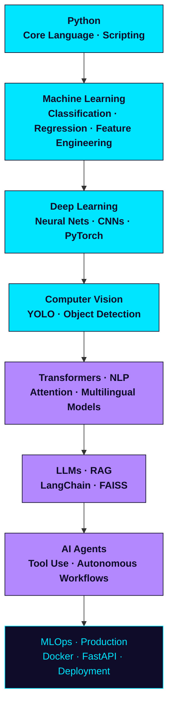
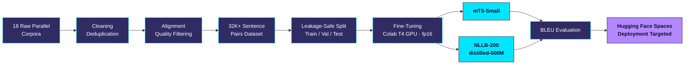

<div align="center">


<a href="https://git.io/typing-svg">
  
</a>

<br>

```python
class SovanBarik:
    def __init__(self):
        self.role      = "AI / ML Engineer"
        self.focus     = "Multilingual NLP & Vision AI Systems"
        self.building  = "BharatTranslate-AI  ·  EN / HI / BN Neural MT"
        self.stack     = ["PyTorch", "Transformers", "TensorFlow", "scikit-learn"]
        self.status    = "open_to_ai_ml_internships"

    def philosophy(self) -> str:
        return "Ship systems that work on messy, real-world data."
```

<a href="https://www.linkedin.com/in/sovan-barik-711bba326/"></a>
<a href="mailto:sovanbarik07@gmail.com"></a>
<a href="https://www.kaggle.com/sovanbarik"></a>
<a href="#"></a>
<a href="#"></a>

<br><br>


<br><br>

<sub>📍 Durgapur, West Bengal, India &nbsp;·&nbsp; 💼 Multilingual NLP &amp; Deep Learning Systems &nbsp;·&nbsp; 🚀 Open to AI/ML Internships</sub>

</div>

<br>

<div align="center">

> Building multilingual and vision AI systems that turn messy, real-world data into working, deployable products.

</div>

<br>

<div align="center">


### Skill Dashboard
<sub>Languages, frameworks, and tools I build with</sub>

</div>

<br>

<div align="center">

<sub>**PROGRAMMING LANGUAGES**</sub>
<br>


<br><br>

<sub>**MACHINE LEARNING & DEEP LEARNING**</sub>
<br>

<br>
<sub>Also building with: Computer Vision (YOLO) · Time-Series Forecasting</sub>

<br><br>

<sub>**NLP & GENERATIVE AI**</sub>
<br>


<br>
<sub>Actively expanding into: LangChain · FAISS · RAG</sub>

<br><br>

<sub>**DATA SCIENCE**</sub>
<br>


<br>
<sub>Also: Matplotlib · Seaborn · EDA</sub>

<br><br>

<sub>**DEPLOYMENT & MLOPS**</sub>
<br>

<br>
<sub>Actively expanding into: FastAPI · Hugging Face Spaces</sub>

<br><br>

<sub>**DEVELOPER TOOLS**</sub>
<br>

<br>
<sub>Also: Google Colab · Jupyter Notebook · Kaggle</sub>

</div>

<br>

<div align="center">


### AI Engineering Roadmap
<sub>From fundamentals to production AI systems</sub>

</div>

<br>



<p align="center"><sub>Cyan = completed · Purple = in progress · Outlined = upcoming &nbsp;|&nbsp; 4 of 8 milestones complete</sub></p>

<br>

<div align="center">


### Flagship Project
<sub>The project I am most invested in right now</sub>

</div>

<br>

<div align="center">

### 🌐 BharatTranslate-AI


<br>
<sub>NLP / Generative AI · Advanced Difficulty</sub>

</div>

A multilingual Neural Machine Translation system for English, Hindi, and Bengali — fine-tuning **mT5-Small** and **NLLB-200-distilled-600M** on a self-built, deduplicated parallel corpus of 32,000+ sentence pairs sourced and cleaned from 18 raw datasets, built to make Indian-language translation more accessible.

**Pipeline**



**Engineering Highlights**
- Built a custom multilingual dataset pipeline: deduplication, cleaning, and sentence alignment across 18 raw sources
- Solved CUDA out-of-memory errors on Colab's T4 GPU using fp16 mixed precision and gradient accumulation
- Designed leakage-safe train/validation/test splits for trustworthy BLEU evaluation
- Targeting deployment on Hugging Face Spaces for public access

**Why it matters:** Most large translation systems underserve Indian languages — this project explores how far efficiently fine-tuned, smaller multilingual models can close that gap.

<sub>**TECH STACK**</sub>
<br>


<br><br>

<a href="#"></a> <a href="#"></a>

<br>

<div align="center">


### More Projects
<sub>Additional systems built end-to-end</sub>

</div>

<br>

<table align="center" width="100%">
<tr>
<td width="50%" valign="top">

### 🌿 Plant Disease Detection

<sub>Computer Vision</sub>

Deep learning web app that classifies plant leaf diseases from images and serves predictions through a Flask application.

**Highlights**
- CNN-based image classification
- Flask web deployment
- Debugged and hardened for correct production behavior

<sub>Python · TensorFlow · Flask</sub>

<a href="#"></a>

</td>
<td width="50%" valign="top">

### 💳 Credit Card Fraud Detection

<sub>Classification</sub>

Fraud detection model trained on highly imbalanced financial transaction data.

**Highlights**
- SMOTE-based class balancing
- Logistic Regression and Random Forest
- Precision-recall optimization with F1 and ROC-AUC evaluation

<sub>Python · scikit-learn · Pandas</sub>

<a href="#"></a>

</td>
</tr>
<tr>
<td width="50%" valign="top">

### 🌊 SONAR Rock vs. Mine Prediction

<sub>Classification</sub>

Binary classification system distinguishing rocks from mines using sonar signal data.

**Highlights**
- Feature scaling and preprocessing
- Logistic Regression model
- Accuracy and confusion-matrix evaluation

<sub>Python · scikit-learn</sub>

<a href="#"></a>

</td>
<td width="50%" valign="top">

### 🔩 Transformers From Scratch

<sub>Deep Learning</sub>

A hands-on, interview-ready collection of Transformer building blocks implemented from scratch.

**Highlights**
- Self-attention and multi-head attention
- Positional encoding
- Encoder-decoder architecture in PyTorch

<sub>Python · PyTorch</sub>

<a href="#"></a>

</td>
</tr>
</table>

<br>

<div align="center">


### GitHub Analytics
<sub>Activity, stats & streaks</sub>

</div>

<br>

<table align="center">
<tr>
<td align="center"><h3>5</h3><sub>Projects Built</sub></td>
<td align="center"><h3>1</h3><sub>Live Deployment</sub></td>
<td align="center"><h3>5</h3><sub>Languages</sub></td>
<td align="center"><h3>3</h3><sub>Core Frameworks</sub></td>
</tr>
</table>

<div align="center">


<br>


<br><br>


<br><br>


<br><br>


</div>

<br>

<div align="center">


### Currently Building
<sub>What I am working on right now</sub>

</div>

<br>

<div align="center">

<sub>B U I L D I N G</sub>
<br>
Retrieval-Augmented Generation pipelines · LangChain · FAISS · Docker · FastAPI · MLOps

<br><br>

<sub>R E S E A R C H I N G</sub>
<br>
NLP · Machine Translation · Computer Vision · Generative AI

<br><br>

<sub>E X P L O R I N G &nbsp; N E X T</sub>
<br>
AI Agents · Fine-Tuning · Knowledge Distillation · Reasoning

</div>

<br>

<div align="center">


### 2026 Roadmap
<sub>Milestones I am working toward</sub>

</div>

<br>

<table align="center" width="100%">
<tr>
<td width="50%" valign="top">

**🎯 Ship & Deploy**
- Ship BharatTranslate-AI to production
- Build and deploy production-ready AI systems

</td>
<td width="50%" valign="top">

**🎯 Deepen Expertise**
- Master Transformer and LLM architectures
- Strengthen MLOps and scalable deployment practice

</td>
</tr>
<tr>
<td width="50%" valign="top">

**🎯 Contribute & Publish**
- Contribute to open-source AI repositories
- Publish research-oriented AI work

</td>
<td width="50%" valign="top">

**🎯 Grow**
- Strengthen Data Structures and Algorithms
- Secure an AI/ML internship

</td>
</tr>
</table>

<br>

<div align="center">

<sub>💡 What drives me: taking messy, real-world problems — imbalanced fraud data, noisy multilingual text, blurry leaf photos — and turning them into systems that actually ship.</sub>

<br><br>

🎓 B.Tech in Computer Science (AI/ML) — MDU Rohtak · Class of 2028 &nbsp;|&nbsp; 📍 Durgapur, West Bengal, India

</div>

<br>

<div align="center">


### Let's Connect

<br>

<a href="https://github.com/sovan2006"></a>
<a href="https://www.linkedin.com/in/sovan-barik-711bba326/"></a>
<a href="mailto:sovanbarik07@gmail.com"></a>
<a href="https://www.kaggle.com/sovanbarik"></a>

<br><br>

⭐ **Thank you for visiting — always open to connect, collaborate, or talk AI.**

<br><br>

### 💭 *"The best AI systems are not defined by complexity, but by the value they create for people."*

<br>


</div>
